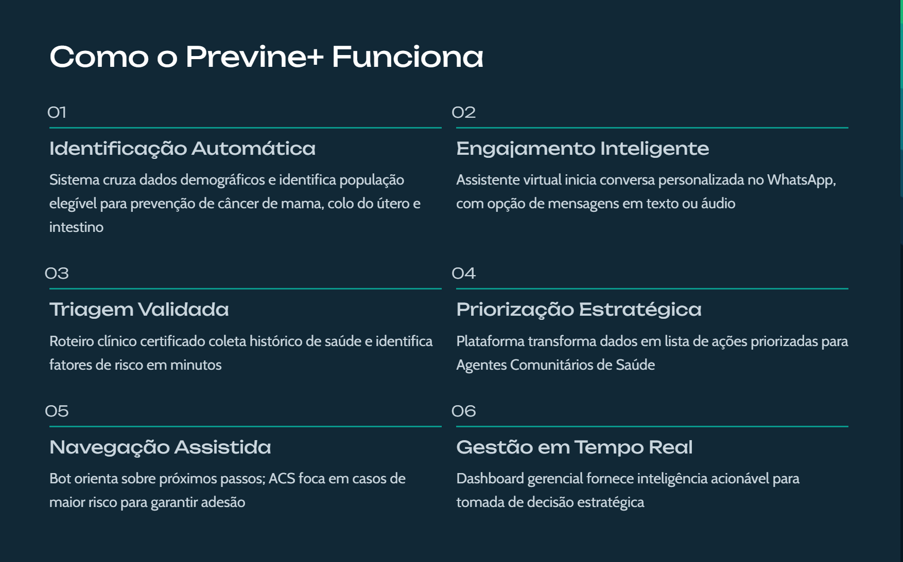
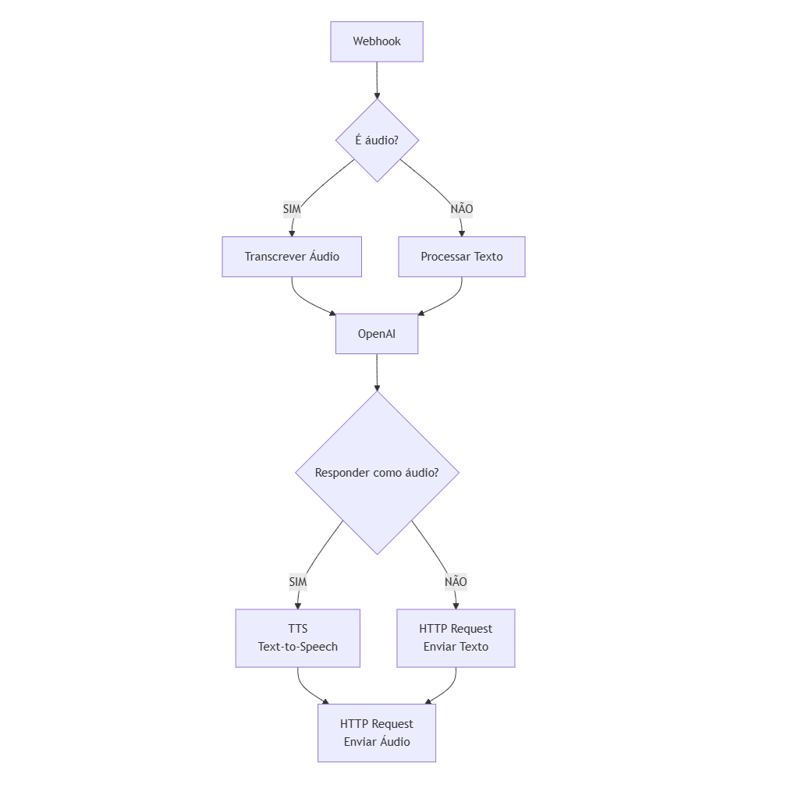
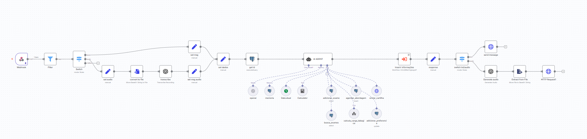

# 🏥 Previne+ - A prevenção que chega até você

## 📋 Sobre

Previne+ é um assistente virtual de saúde que democratiza o acesso à prevenção do câncer através do WhatsApp — uma plataforma que 98% dos brasileiros já conhecem e confiam.

Por que PREVINA+?

•✅ Simples e direto - qualquer pessoa entende

•✅ Ação positiva - "previna" é verbo ativo

•✅ "+" significa mais saúde, mais cuidado, mais vida

•✅ Alinhamento com Previne Brasil (programa federal)

•✅ Memorável - fácil de lembrar e pronunciar

•✅ Positivo - não assusta (não usa a palavra "câncer" que pode afastar as pessoas da solução)

# 🚀 Como Executar

## Clone o repositório e acesse a pasta

* git clone https://github.com/Maysamkt/bot-soprevine
* cd bot-soprevine

---

1. instale as dependências
   > `npm install`
2. Configure as variáveis no

   > `.env.example`

3. Execute em 2 terminais

   > Terminal 1 - Seu servidor:
   >
   > > `npm start`

   > Terminal 2 - Ngrok:
   >
   > > `npm run ngrok`

4. Escaneie o QR Code no WhatsApp

---

## 🔧 Tecnologias utilizadas

- Node.js + Express
- WhatsApp Web.js
- n8n (orquestração)
- Ngrok (tunneling)

## 🛡️ Segurança

Todas as credenciais protegidas por variáveis de ambiente.

## 📤 N8N Docs

- Banco de Dados - Diagrama

  

  ***

- Integração texto-áudio

- Fluxo do Agente

  

- Acesse o protótipo funcional através do link abaixo

  https://enginewebhook.w29.unigate.com.br/webhook/5666f280-4ec4-4a93-8a3c-a8c0854b5ec1/chat

  ---

- Esse projeto foi desenvolvido para o Hackathon SBOC Code4Cancer 2025 organizado pela Hackathon Brasil
- Equipe 29
- Aline Miyaki  - UX/UI Designer
- Fabiano Camara - Desenvolvedor
- Lays Costa - Especialista/Oncologista
- Maysa Santos - Desenvolvedora/Marketing
- Romênia - Negócios
